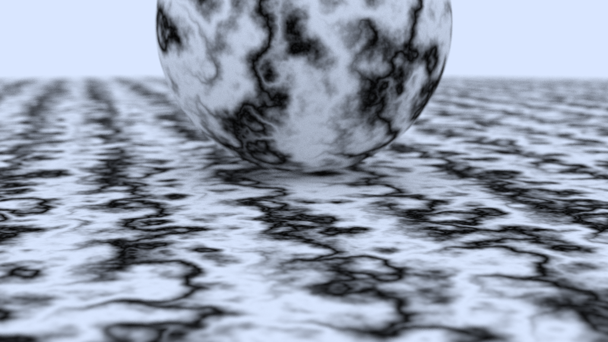

# Ray Tracing In One Weekend


This is a path tracer based on the book series [Ray Tracing in One Weekend](https://raytracing.github.io/), implemented in Rust. 

It can render scenes made of spheres, planes, cubes, and paraboloids as geometric primitives. The scene is from the point of view of a simulated "camera" with adjustable position, field of view, and aperture.

It supports the following types of textures:
- Solid colors
- Image textures
- Reflective surfaces (mirrors)
- Transparent glass with refraction
- Procedurally generated textures

It also supports rendering volumetric objects, such as clouds and fog.

Computation is done in parallel using [Rayon](https://github.com/rayon-rs/rayon) with a thread pool for multithreading, where each job processes a 16x16 block of pixels. This ensures that each job is large enough to reduce scheduling overhead while also improving spatial locality in memory access since neighboring pixels are likely to intersect the same objects and sample the same textures.

Also, I use a Bounding Volume Hierarchy (BVH) for efficient ray-object intersection tests.

It outputs a PNG image

To use it, you'll need to have [Cargo](https://doc.rust-lang.org/cargo/getting-started/installation.html) installed. Then, just enter the main directory and run this command

```sh
cargo run
```

For maximum performance but a longer compile time, use:

```sh
RUSTFLAGS="-C target-cpu=native" cargo run --release
```

Here's a gallery of all the scenes I've programmed in 1024 width images with 300 samples per pixel. If you want to see some of these in higher quality, you can check out [this post](https://www.aricasas.com/programming/render-showcase/) in my webpage.





